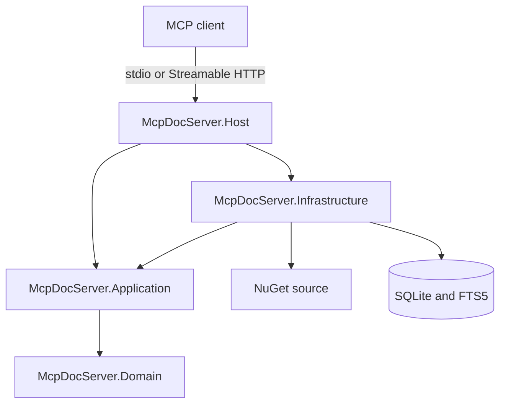
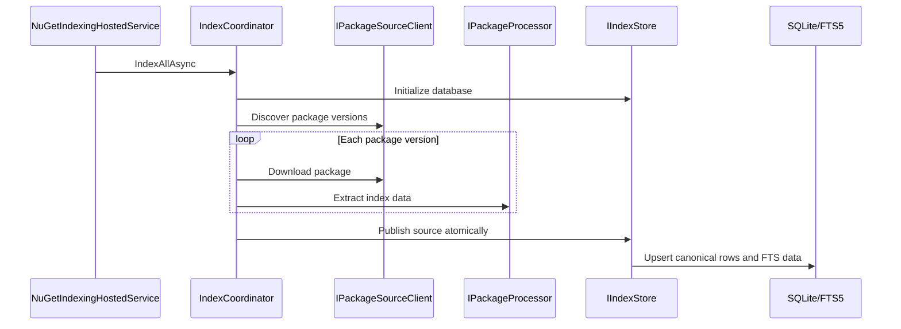
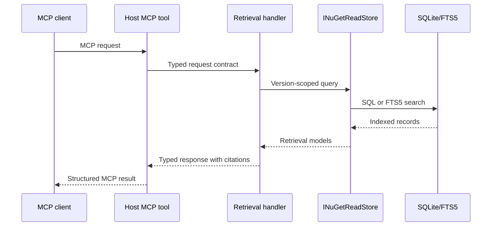

# Solution Architecture

## Overview

McpDocServer is a .NET MCP server that indexes NuGet packages and exposes their
documentation, metadata, versions, and public symbols as version-aware evidence.

The solution follows a layered architecture:



Dependencies point inward. Domain has no project dependencies, Application
depends only on Domain, Infrastructure implements Application abstractions, and
Host is the composition root.

## Projects

### McpDocServer.Domain

Contains persistence-independent indexing data:

- Package identities and stable ID generation.
- Package metadata, artifacts, document chunks, symbols, dependencies, and
  target frameworks.
- No NuGet, SQLite, MCP, hosting, or configuration dependencies.

### McpDocServer.Application

Contains use cases, public MCP contracts, and interfaces implemented by outer
layers.

The project is organized by feature:

```text
Contracts/
  Common/
  ResolveLibrary/
  ListVersions/
  QueryDocs/
  GetSymbol/

Indexing/
  Models/
  Abstractions/
  Services/

Retrieval/
  Models/
  Abstractions/
  Services/
```

- `Contracts` contains the request and response models serialized by MCP tools.
- `Models` contains internal feature data passed between application and
  infrastructure.
- `Abstractions` defines configuration, storage, package-processing, and source
  boundaries.
- `Services` contains executable application behavior such as handlers,
  orchestration, version resolution, citation generation, and response
  budgeting.

Application services do not depend on concrete NuGet, SQLite, or transport
implementations.

### McpDocServer.Infrastructure

Implements Application abstractions using external technologies:

- NuGet package discovery and download through `NuGet.Protocol`.
- Safe `.nupkg` inspection without loading or executing package assemblies.
- Metadata, README, XML documentation, target framework, dependency, and public
  symbol extraction.
- Document chunking and SHA-256 content hashing.
- SQLite schema management, atomic index publication, and FTS5 search.
- Retrieval of indexed documents, versions, symbols, and MCP resources.

Infrastructure depends on Application, and transitively Domain. It must not
contain MCP tool or transport behavior.

### McpDocServer.Host

Is the executable and composition root:

- Loads and validates configuration.
- Registers Application and Infrastructure implementations.
- Selects one transport per process.
- Exposes the four MCP tools and NuGet resource templates.
- Runs startup diagnostics and optional startup indexing.
- Converts host configuration into Application settings.

Supported transports are:

- `stdio`, using the core MCP server transport.
- Stateless Streamable HTTP, mapped to the configured endpoint path. Local
  unauthenticated HTTP is restricted to a loopback address.

## Dependency Rules

```text
Domain          -> no project references
Application     -> Domain
Infrastructure  -> Application
Host            -> Application + Infrastructure
Tests           -> projects required by each test scenario
```

The Application layer owns interfaces because it defines the behavior it needs.
Infrastructure supplies implementations through dependency injection. Host
selects and wires those implementations but does not implement indexing or
retrieval business logic.

Architecture tests enforce the inner project dependency rules.

## Indexing Flow



The pipeline:

1. Reads configured NuGet sources, package IDs, prefixes, and processing limits.
2. Discovers candidate package versions.
3. Downloads each package to a temporary file with size and timeout limits.
4. Inspects the archive and extracts immutable `PackageIndexData`.
5. Publishes changed packages and removes missing versions in one source-level
   operation.
6. Reports `succeeded`, `partial_success`, or `failed` without allowing one
   package failure to discard other successful packages.

Package content hashes make repeated indexing idempotent and allow unchanged
packages to be retained without rewriting their indexed content.

## Retrieval Flow



The public tool surface is:

- `resolve_library`: ranks indexed packages and returns `nuget:{packageId}` IDs.
- `list_versions`: returns indexed semantic versions and version-selection
  context.
- `query_docs`: retrieves ranked documentation and symbol evidence for one
  selected package version.
- `get_symbol`: returns a public type or member and related symbol evidence.

Retrieval is version isolated. Handlers resolve a package and version before
querying documents or symbols, enforce configured result and response limits,
and return evidence with stable `nuget://` citations.

The Host also exposes resource templates for reading the exact indexed artifact
or symbol referenced by a citation.

## Composition

Dependency injection registrations are split by ownership:

- `Application.AddApplication()` registers handlers and application services.
- `Infrastructure.AddInfrastructure()` registers NuGet, processing, hashing,
  SQLite, and retrieval implementations.
- `Host.AddMcpDocServerCore()` binds configuration, composes both layers, and
  registers hosted services.
- `Host.WithMcpDocServerTools()` publishes tools and resources through the
  selected MCP transport.

All current services are singletons and must therefore remain stateless or use
thread-safe dependencies. Request-specific state belongs in method-local
objects and cancellation scopes.

## Testing Strategy

- Unit tests cover domain behavior, configuration validation, archive safety,
  extraction, version selection, serialization, and architecture rules.
- Integration tests build fixture NuGet packages, index them into temporary
  SQLite databases, and exercise the complete retrieval pipeline.
- MCP tests verify tool discovery, invocation, resources, stdio, and stateless
  HTTP behavior.
- Child-process tests verify the packaged Host configuration and transport
  startup rather than only in-process service registration.

## Extension Guidelines

- Add new external integrations behind an Application abstraction.
- Keep MCP wire shapes in `Application.Contracts`; do not reuse persistence
  records as transport contracts.
- Keep feature behavior in feature-local `Services`, not in Host tools or
  Infrastructure implementations.
- Add persisted concepts to Domain only when they are independent of SQLite or
  NuGet APIs.
- Preserve package-version isolation and citation traceability for every new
  retrieval capability.
