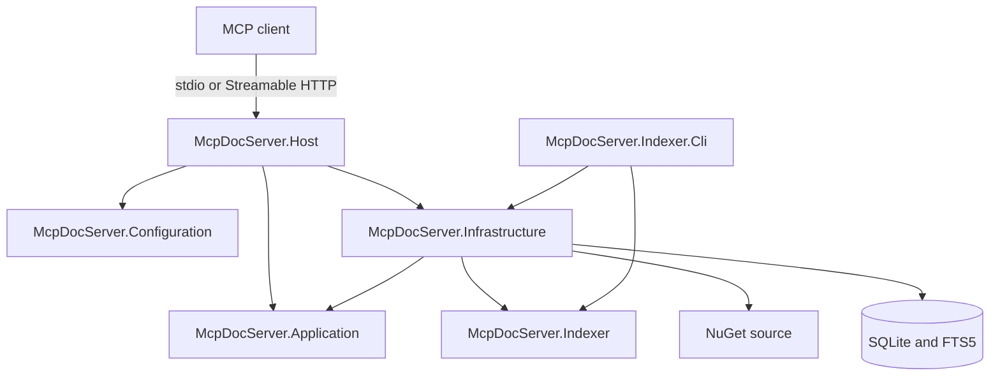
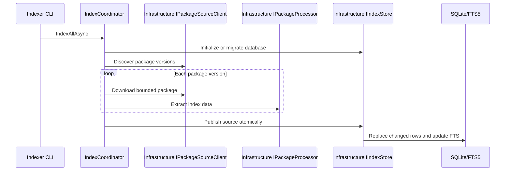
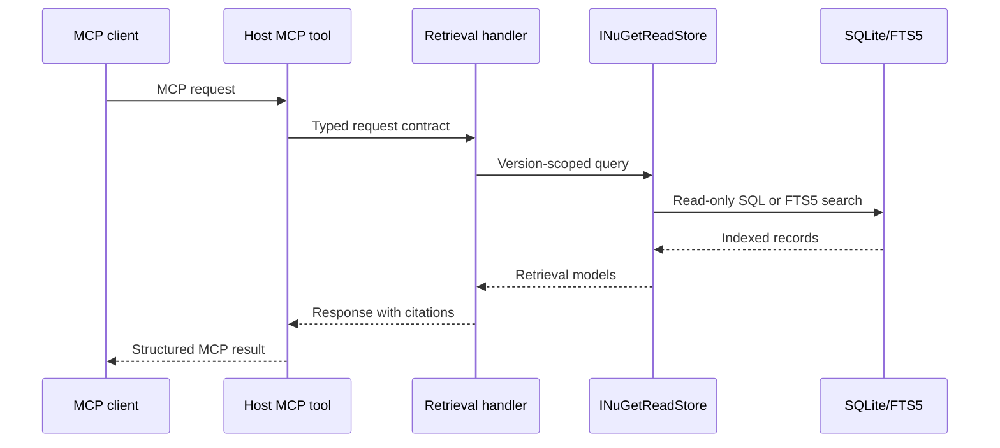

# Solution Architecture

## Overview

McpDocServer separates package index production from MCP retrieval:



The Host is retrieval-only. The Indexer library defines the indexing use
cases, and the Indexer CLI is the separate one-shot composition root and sole
index writer process.

## Projects

### McpDocServer.Configuration

Contains Host transport and retrieval option contracts and validation. It has
no project references.

### McpDocServer.Application

Contains MCP wire contracts, retrieval models and abstractions, and retrieval
services. It has no project references and does not depend on SQLite, NuGet, or
MCP transport implementations.

### McpDocServer.Indexer

Contains the inner indexing feature boundary:

- Source-neutral indexing models.
- Ports for source access, package processing, configuration, and persistence.
- `IIndexCoordinator` and indexing orchestration.

Indexer has no project references and contains no hosting, NuGet client,
archive-processing, or SQLite implementation packages.

### McpDocServer.Infrastructure

Implements Application retrieval abstractions and Indexer ports:

- Read-only SQLite and FTS5 retrieval.
- NuGet discovery, metadata lookup, and bounded package download.
- Safe archive inspection and metadata-only symbol extraction.
- Document chunking and SHA-256 hashing.
- SQLite schema migration, atomic publication, FTS5 writes, and run history.
- Local dependency diagnostics.

Infrastructure references Application and Indexer. Retrieval and indexing use
separate registration methods so the Host never composes index writers.

### McpDocServer.Host

Is the MCP executable and retrieval composition root:

- Loads and validates Host configuration.
- Registers Application and retrieval Infrastructure services.
- Selects stdio or stateless Streamable HTTP.
- Exposes four MCP tools and NuGet resource templates.
- Opens the SQLite index read-only.

The Host does not contact NuGet sources or register Indexer services.

### McpDocServer.Indexer.Cli

Is the one-shot indexing executable and composition root:

- Owns indexing configuration, validation, and `appsettings.json`.
- Converts CLI options into source-neutral Indexer settings.
- Registers Indexer orchestration and Infrastructure indexing adapters.
- Runs every configured source once and reports summaries.

It exits `0` for success or no configured sources. It exits `1` for partial
success, failure, invalid configuration, or cancellation. Recurring execution
uses an external scheduler, and only one CLI process may write to a given
SQLite database at a time.

## Dependency Rules

```text
Application    -> no project references
Configuration  -> no project references
Indexer        -> no project references
Infrastructure -> Application + Indexer
Host           -> Application + Configuration + Infrastructure
Indexer.Cli    -> Indexer + Infrastructure
Tests          -> projects required by each scenario
```

Architecture tests enforce this graph and verify that the former indexing
projects are absent.

## Indexing Flow



Package content hashes and deterministic IDs make repeated runs idempotent.
Unchanged package content is not rewritten. `index_runs` intentionally records
each execution, while canonical package, version, artifact, and symbol rows are
not duplicated.

## Retrieval Flow



Qualified `nuget:{environment}/{packageId}` identifiers never cross
environments. Legacy identifiers select by `EnvironmentOrder` and
`SourceOrder`. All evidence remains isolated to one selected package version.

## Composition

- `Application.AddApplication()` registers retrieval handlers and policies.
- `Indexer.AddIndexer()` registers indexing orchestration only.
- `Infrastructure.AddRetrievalInfrastructure()` registers read-only retrieval
  adapters.
- `Infrastructure.AddIndexingInfrastructure()` registers concrete indexing
  adapters.
- `Host.AddMcpDocServerCore()` binds Host configuration and composes retrieval.
- `Indexer.Cli.AddIndexerCli(configuration)` binds CLI configuration and
  composes the complete indexing pipeline.
- `Host.WithMcpDocServerTools()` publishes tools and resources.

## Testing Strategy

- Unit tests cover configuration, archive safety, chunking, symbol extraction,
  version selection, serialization, registration boundaries, and architecture
  rules.
- Integration tests index local fixture packages into temporary SQLite
  databases and exercise retrieval end to end.
- Child-process tests verify Indexer CLI exit codes and Host stdio/HTTP
  behavior.
- Idempotency tests run indexing repeatedly and verify canonical rows remain
  unique while run history grows.

## Extension Guidelines

- Keep MCP wire shapes in `Application.Contracts`.
- Add retrieval integrations behind Application abstractions.
- Keep indexing models, ports, and orchestration in Indexer.
- Implement external indexing concerns in Infrastructure.
- Keep executable configuration and lifecycle behavior in Indexer CLI.
- Never execute package assemblies.
- Preserve package-version isolation and citation traceability.
