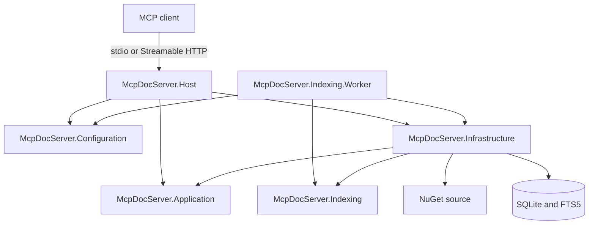
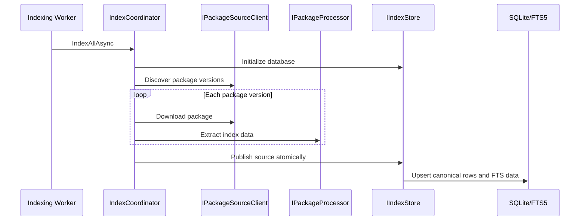
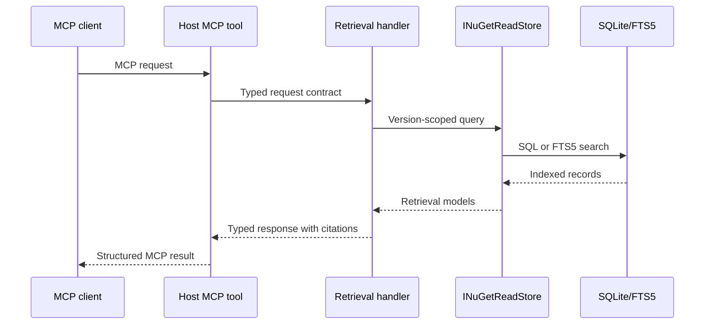

# Solution Architecture

## Overview

McpDocServer is a .NET MCP server that indexes NuGet packages and exposes their
documentation, metadata, versions, and public symbols as version-aware evidence.

The solution separates MCP retrieval from index production:



Configuration, Application, and Indexing have no project references.
Infrastructure implements abstractions from Application and Indexing. Host is
the retrieval composition root, while Worker is the indexing composition root.

## Projects

### McpDocServer.Configuration

Contains shared Host and Worker option contracts and their independent
validators. It has no dependency on either executable or feature project.

### McpDocServer.Indexing

Contains the complete source-neutral indexing feature:

- Package identities and stable ID generation.
- Package metadata, artifacts, document chunks, symbols, dependencies, and
  target frameworks.
- Configuration, source, processing, hashing, and storage abstractions.
- Indexing orchestration, run results, limits, and downloaded-package lifetime
  management.
- No NuGet, SQLite, MCP, hosting, or configuration dependencies.

### McpDocServer.Application

Contains retrieval use cases, public MCP contracts, and interfaces implemented
by outer layers.

The project is organized by feature:

```text
Contracts/
  Common/
  ResolveLibrary/
  ListVersions/
  QueryDocs/
  GetSymbol/

Retrieval/
  Models/
  Abstractions/
  Services/
```

- `Contracts` contains the request and response models serialized by MCP tools.
- Retrieval `Models` contain data passed between application and
  infrastructure.
- Retrieval `Abstractions` define configuration and read-store boundaries.
- Retrieval `Services` contain handlers, version resolution, citation
  generation, and response budgeting.

Application services do not depend on concrete NuGet, SQLite, or transport
implementations.

### McpDocServer.Infrastructure

Implements Application and Indexing abstractions using external technologies:

- NuGet package discovery and download through `NuGet.Protocol`.
- Safe `.nupkg` inspection without loading or executing package assemblies.
- Metadata, README, XML documentation, target framework, dependency, and public
  symbol extraction.
- Document chunking and SHA-256 content hashing.
- SQLite schema management, atomic index publication, and FTS5 search.
- Retrieval of indexed documents, versions, symbols, and MCP resources.

Infrastructure depends on Application and Indexing. It must not contain MCP
tool or transport behavior.

### McpDocServer.Host

Is the executable and composition root:

- Loads and validates configuration.
- Registers Application and retrieval-only Infrastructure implementations.
- Selects one transport per process.
- Exposes the four MCP tools and NuGet resource templates.
- Runs retrieval startup diagnostics.
- Converts Host configuration into Application retrieval settings.

Supported transports are:

- `stdio`, using the core MCP server transport.
- Stateless Streamable HTTP, mapped to the configured endpoint path. Local
  unauthenticated HTTP is restricted to a loopback address.

The Host contains no index writer or indexing schedule. Its availability is
independent of source refresh duration and failures.

### McpDocServer.Indexing.Worker

Is the sole index-writing executable and indexing composition root:

- Loads and validates database, source, schedule, and processing settings.
- Runs one refresh immediately at startup.
- Waits `RefreshInterval` after each completed run before repeating.
- Executes refreshes sequentially, so one process never overlaps its own runs.
- Supports `--once` for manual or scheduled one-shot refreshes.
- Exits `0` for success or no configured sources and `1` for failed,
  partially successful, or unhandled runs in one-shot mode.

## Dependency Rules

```text
Configuration  -> no project references
Application    -> no project references
Indexing       -> no project references
Infrastructure -> Application + Indexing
Host           -> Application + Configuration + Infrastructure
Worker         -> Configuration + Indexing + Infrastructure
Tests          -> projects required by each test scenario
```

Application and Indexing own the interfaces required by their respective
features. Infrastructure supplies implementations through dependency injection.
Host and Worker select only the implementations required by their respective
processes and do not implement indexing or retrieval business logic.

Architecture tests enforce the inner project dependency rules.

## Indexing Flow



The pipeline:

1. Reads configured NuGet sources, package IDs, prefixes, and processing limits.
2. Discovers candidate package versions.
3. Downloads each package to a temporary file with size and timeout limits.
4. Inspects the archive and extracts immutable `PackageIndexData`.
5. Publishes changed packages and removes missing versions in one source-level
   operation.
6. Reports `succeeded`, `partial_success`, or `failed` without allowing one
   package failure to discard other successful packages.

Package content hashes make repeated indexing idempotent and allow unchanged
packages to be retained without rewriting their indexed content.

## Retrieval Flow



The public tool surface is:

- `resolve_library`: ranks indexed packages and returns one
  `nuget:{environment}/{packageId}` ID per environment. Its optional
  environment filter restricts discovery.
- `list_versions`: returns indexed semantic versions and version-selection
  context.
- `query_docs`: retrieves ranked documentation and symbol evidence for one
  selected package version.
- `get_symbol`: returns a public type or member and related symbol evidence.

Retrieval is environment and version isolated. Qualified library IDs never
cross environments. Legacy `nuget:{packageId}` IDs select an environment and
source through `EnvironmentOrder` and `SourceOrder`. Handlers then resolve one
version, enforce configured result and response limits, and return evidence
with stable `nuget://` citations.

Environment is persisted source metadata and is not an authorization boundary.
Several concrete NuGet sources may belong to one environment; citations retain
the concrete source name.

The Host also exposes resource templates for reading the exact indexed artifact
or symbol referenced by a citation.

## Composition

Dependency injection registrations are split by ownership:

- `Application.AddApplication()` registers handlers and application services.
- `Indexing.AddIndexing()` registers indexing orchestration.
- `Infrastructure.AddRetrievalInfrastructure()` registers SQLite retrieval
  implementations.
- `Infrastructure.AddIndexingInfrastructure()` registers NuGet, processing,
  hashing, and SQLite index-writing implementations.
- `Host.AddMcpDocServerCore()` binds Host configuration and composes retrieval.
- `Worker.AddIndexingWorkerCore()` binds Worker configuration and composes
  indexing.
- `Host.WithMcpDocServerTools()` publishes tools and resources through the
  selected MCP transport.

All current services are singletons and must therefore remain stateless or use
thread-safe dependencies. Request-specific state belongs in method-local
objects and cancellation scopes.

## Testing Strategy

- Unit tests cover indexing models, configuration validation, archive safety,
  extraction, version selection, serialization, and architecture rules.
- Integration tests build fixture NuGet packages, index them into temporary
  SQLite databases, and exercise the complete retrieval pipeline.
- MCP tests verify tool discovery, invocation, resources, stdio, and stateless
  HTTP behavior.
- Child-process tests verify packaged Host transport startup and Worker
  one-shot exit behavior rather than only in-process service registration.

## Extension Guidelines

- Add new retrieval integrations behind an Application abstraction and new
  indexing integrations behind an Indexing abstraction.
- Keep MCP wire shapes in `Application.Contracts`; do not reuse persistence
  records as transport contracts.
- Keep feature behavior in feature-local `Services`, not in Host tools or
  Infrastructure implementations.
- Keep indexing models source-neutral and independent of SQLite and NuGet APIs.
- Preserve package-version isolation and citation traceability for every new
  retrieval capability.
